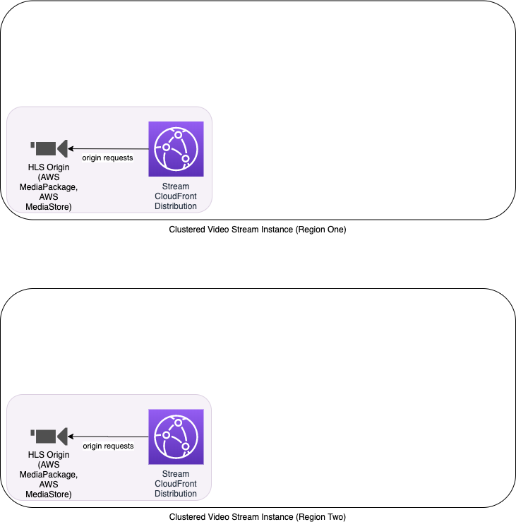
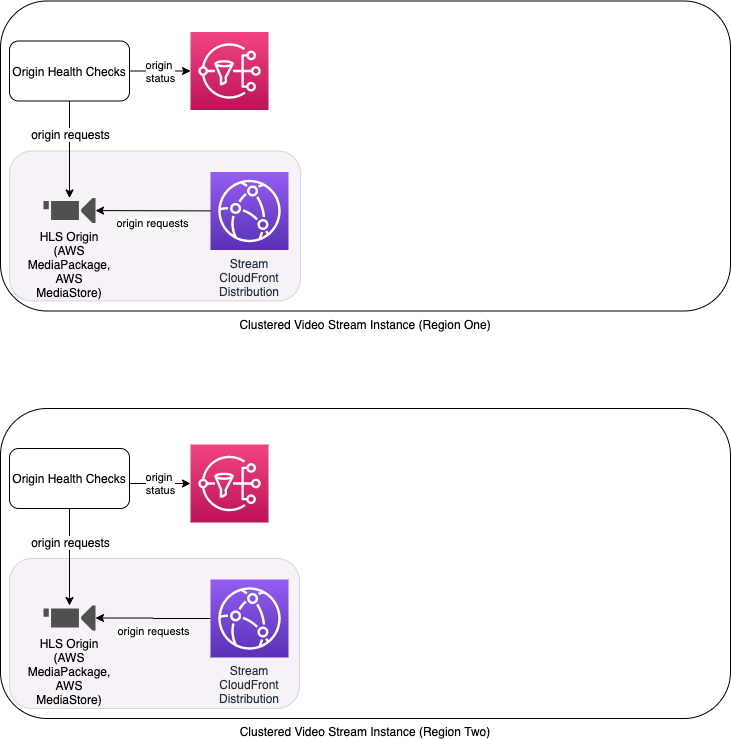
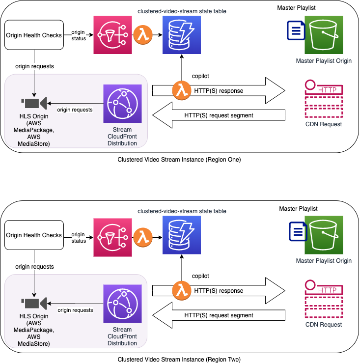
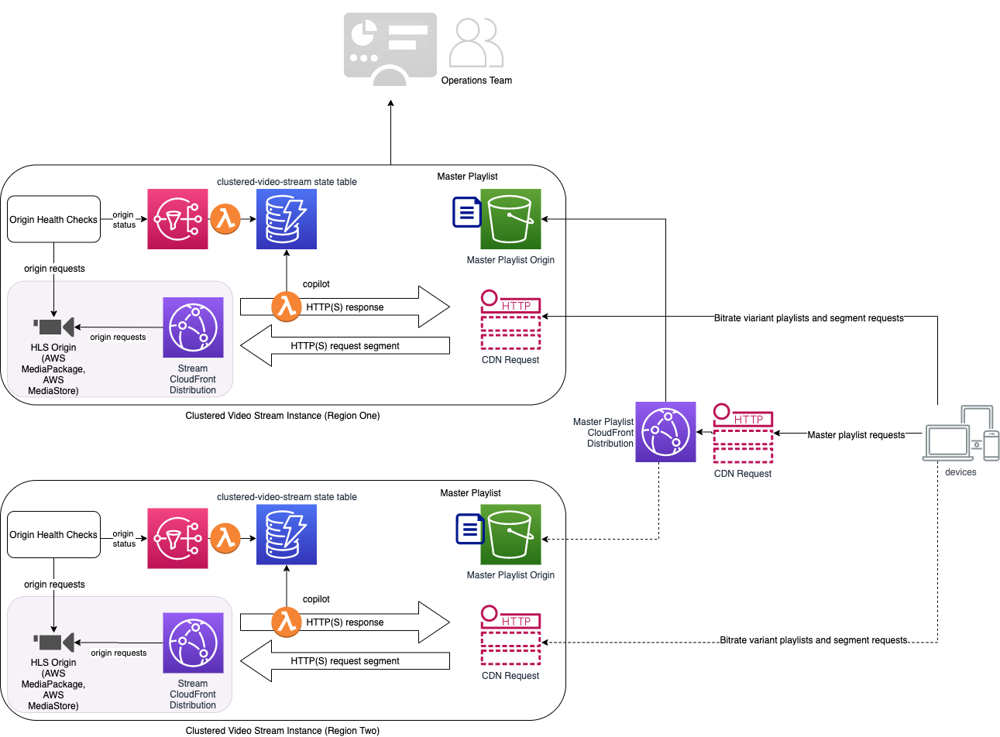

# Deployment 

## Terminology

**stream-regions**: regions where redundant video streams are running

## Prerequisites

1. Decide which AWS regions you want to use to host your clustered video stream in.  The architecture currently supports a two region deploy.  
2. Follow the instructions in the [Developing](#developing) section to build and host the project in your AWS account.
3. Deploy your live streams to RegionOne and RegionTwo as you normally do.  The streams must have a separate CloudFront distribution for each region.  You can use the [Live Streaming on AWS](https://aws.amazon.com/solutions/live-streaming-on-aws/) solution as a starting point for setting up the live streams.  Simply deploy an instance of that solution in each of your chosen regions.
4. Gather values for the following properties of these base live streams to be used in deploying the rest of the stack:
    * *RegionOne* - the first region you want to deploy stream instances to
    * *RegionTwo* - the second region you want to deploy stream instances to
    * For each region:
        * *CloudFrontDistributionId* - Id of the distribution in that region
        * *DistributionDomain* - domain name of the CloudFront Distribution in that region
        * *DistributionPlaylistUrl *- The url, using the DistributionDomain, of the master playlist for the stream in this region.
        * *OriginPlaylistUrl* - The url, using the OriginDomain, of the master playlist for the stream in this region.  If you are using MediaPackage as an origin, you can find this url in the MediaPackage console 

**Result**



## Deploy the Stale Playlist Detector stack

Use CloudFormation to deploy the stale playlist detector in each stream-region using the information below.

**Template:** stale-playlist-detector.template
**Run in regions:** RegionOne AND RegionTwo
**Required Inputs:**

* *DistributionPlaylistUrl*
* *OriginPlaylistUrl* 

**Outputs used later in deployments**

* *TopicArn* - the ARN of the SNS topic stale playlist metrics are written to

**Result**




## Deploy the copilot lambda in us-east-1

Lambda@Edge functions must be defined in us-east-1 before they can be attached to edge locations.

**Template:** copilot.template
**Run in regions:** us-east-1
**Required Inputs:**

* *ClusteredVideoStreamName* - the unique name across AWS for this clustered video stream.
* *RegionOne*
* *RegionOneDistributionDomain*
* *RegionTwo*
* *RegionTwoDistributionDomain*

**Outputs used later in deployments**

* *CopilotLambdaArn* - the ARN of the copilot lambda
* *CopilotLambdaVersion* - the Version of this copilot lambda

## Deploy the clustered-video-stream-instance stack

**Template:** clustered-video-stream-instance.template
**Run in regions:** RegionOne **AND** RegionTwo
**Required Inputs:**

* *ClusteredVideoStreamName* 
* *RegionOne*
* *RegionTwo*
* *CloudfrontDistributionId* - The CloudfronDistributionId from the deployment region

**Outputs used later in deployments**

* *MasterPlaylistBucket* - the name of the master playlist bucket deployed in this region.  
* *OriginAccessIdentity* - Origin access identity created to access the MasterPlaylistBucket from CloudFront.

**Result**




## Deploy the clustered-video-stream stack

**Template:** clustered-video-stream.template
**Run in regions:** Any one region - RegionOne **OR** RegionTwo
**Required Inputs:**

* *ClusteredVideoStreamName*
* *RegionOne*
* *RegionOneCloudfrontDistributionId*
* *RegionOneOriginAccessIdentity*
* *RegionOneMasterPlaylistBucket*
* *RegionTwo*
* *RegionOneCloudfrontDistributionId*
* *RegionOneOriginAccessIdentity*
* *RegionOneMasterPlaylistBucket*

**Output **

* *MasterPlaylistCloudFrontDomain* - the domain name used to access the master playlist.  This is the domain we will use to distribute the clustered video stream to viewers.

**Result**



## Create the Merged Master Playlist  

The merged master playlist combines the master playlist entries from each origin into a single playlist that can be used to switch between hosts (AWS regions) when the client's player detects a problem. 

You will need:

1. curl or httpie tool
2. text editor
2. DistributionPlaylistUrl for RegionOne and RegionTwo
3. MasterPlaylistBucket names for RegionOne and RegionTwo
4. MasterPlaylistCloudfrontDomain name

### Getting Playlists

1. Open a new text file in your editor
2. Use curl or httpie to get playlists from RegionOne and RegionTwo DistributionPlaylistUrl
3. Copy each playlist into the editor, one after the other

Your command might look something like this:

`curl https://d1q747mcnm9q46.cloudfront.net/out/v1/f53b2dd7810e43f4a05bffec4aa5c7a1/index.m3u8`

The output will look like:

```
#EXTM3U
#EXT-X-VERSION:4
#EXT-X-INDEPENDENT-SEGMENTS
#EXT-X-STREAM-INF:BANDWIDTH=4285600,AVERAGE-BANDWIDTH=4285600,RESOLUTION=1280x720,FRAME-RATE=30.000,CODECS="avc1.4D401F,mp4a.40.2"
index_1.m3u8
#EXT-X-STREAM-INF:BANDWIDTH=2635564,AVERAGE-BANDWIDTH=2635564,RESOLUTION=960x540,FRAME-RATE=30.000,CODECS="avc1.4D401F,mp4a.40.2"
index_2.m3u8
#EXT-X-STREAM-INF:BANDWIDTH=1425600,AVERAGE-BANDWIDTH=1425600,RESOLUTION=640x360,FRAME-RATE=30.000,CODECS="avc1.4D401E,mp4a.40.2"
index_3.m3u8
#EXT-X-I-FRAME-STREAM-INF:BANDWIDTH=1900000,CODECS="avc1.4D401F",RESOLUTION=1280x720,URI="index_4.m3u8"

```

Copy all of this into the editor and do the same the other region.


### Editing and Removing Extras

1. Remove the additional header from the RegionTwo playlist content
2. Make all relative URLs into absolute URLs by adding the fully qualified domain names to each child playlist
2. Special consideration for other playlists

Leave a single header at the top of the text file. Remove the header pasted from the RegionTwo playlist:

```
#EXTM3U
#EXT-X-VERSION:4
#EXT-X-INDEPENDENT-SEGMENTS
```

Add the fully qualified domain name to each child playlist. Add the RegionOne DistributionPlaylistUrl domain name and path to the first set of child playlists. Add the RegionTwo DistributionPlaylistUrl domain name and path to the second set of child playlists. Your file should look similar to the example below.


```
#EXTM3U
#EXT-X-VERSION:4
#EXT-X-INDEPENDENT-SEGMENTS

#EXT-X-STREAM-INF:BANDWIDTH=4285600,AVERAGE-BANDWIDTH=4285600,RESOLUTION=1280x720,FRAME-RATE=30.000,CODECS="avc1.4D401F,mp4a.40.2"
https://d1q747mcnm9q46.cloudfront.net/out/v1/f53b2dd7810e43f4a05bffec4aa5c7a1/index_1.m3u8
#EXT-X-STREAM-INF:BANDWIDTH=2635564,AVERAGE-BANDWIDTH=2635564,RESOLUTION=960x540,FRAME-RATE=30.000,CODECS="avc1.4D401F,mp4a.40.2"
https://d1q747mcnm9q46.cloudfront.net/out/v1/f53b2dd7810e43f4a05bffec4aa5c7a1/index_2.m3u8
#EXT-X-STREAM-INF:BANDWIDTH=1425600,AVERAGE-BANDWIDTH=1425600,RESOLUTION=640x360,FRAME-RATE=30.000,CODECS="avc1.4D401E,mp4a.40.2"
https://d1q747mcnm9q46.cloudfront.net/out/v1/f53b2dd7810e43f4a05bffec4aa5c7a1/index_3.m3u8
#EXT-X-I-FRAME-STREAM-INF:BANDWIDTH=1900000,CODECS="avc1.4D401F",RESOLUTION=1280x720,URI="index_4.m3u8"

#EXT-X-STREAM-INF:BANDWIDTH=4285600,AVERAGE-BANDWIDTH=4285600,RESOLUTION=1280x720,FRAME-RATE=30.000,CODECS="avc1.4D401F,mp4a.40.2"
https://d3623mp9gw7c0l.cloudfront.net/out/v1/3889cc3066c34b11ad01a1be071fb09a/index_1.m3u8
#EXT-X-STREAM-INF:BANDWIDTH=2635564,AVERAGE-BANDWIDTH=2635564,RESOLUTION=960x540,FRAME-RATE=30.000,CODECS="avc1.4D401F,mp4a.40.2"
https://d3623mp9gw7c0l.cloudfront.net/out/v1/3889cc3066c34b11ad01a1be071fb09a/index_2.m3u8
#EXT-X-STREAM-INF:BANDWIDTH=1425600,AVERAGE-BANDWIDTH=1425600,RESOLUTION=640x360,FRAME-RATE=30.000,CODECS="avc1.4D401E,mp4a.40.2"
https://d3623mp9gw7c0l.cloudfront.net/out/v1/3889cc3066c34b11ad01a1be071fb09a/index_3.m3u8
#EXT-X-I-FRAME-STREAM-INF:BANDWIDTH=1900000,CODECS="avc1.4D401F",RESOLUTION=1280x720,URI="index_4.m3u8"
```

You will also need to find and update other playlist statements in the file. Generally, you will need to turn any relative URL or standalone filename into an absolute URL with a hostname and path. Notice the two `#EXT-X-I-FRAME-STREAM-INF` playlists above and the change below.

```
#EXTM3U
#EXT-X-VERSION:4
#EXT-X-INDEPENDENT-SEGMENTS

#EXT-X-STREAM-INF:BANDWIDTH=4285600,AVERAGE-BANDWIDTH=4285600,RESOLUTION=1280x720,FRAME-RATE=30.000,CODECS="avc1.4D401F,mp4a.40.2"
https://d1q747mcnm9q46.cloudfront.net/out/v1/f53b2dd7810e43f4a05bffec4aa5c7a1/index_1.m3u8
#EXT-X-STREAM-INF:BANDWIDTH=2635564,AVERAGE-BANDWIDTH=2635564,RESOLUTION=960x540,FRAME-RATE=30.000,CODECS="avc1.4D401F,mp4a.40.2"
https://d1q747mcnm9q46.cloudfront.net/out/v1/f53b2dd7810e43f4a05bffec4aa5c7a1/index_2.m3u8
#EXT-X-STREAM-INF:BANDWIDTH=1425600,AVERAGE-BANDWIDTH=1425600,RESOLUTION=640x360,FRAME-RATE=30.000,CODECS="avc1.4D401E,mp4a.40.2"
https://d1q747mcnm9q46.cloudfront.net/out/v1/f53b2dd7810e43f4a05bffec4aa5c7a1/index_3.m3u8
#EXT-X-I-FRAME-STREAM-INF:BANDWIDTH=1900000,CODECS="avc1.4D401F",RESOLUTION=1280x720,URI="https://d1q747mcnm9q46.cloudfront.net/out/v1/f53b2dd7810e43f4a05bffec4aa5c7a1/index_4.m3u8"

#EXT-X-STREAM-INF:BANDWIDTH=4285600,AVERAGE-BANDWIDTH=4285600,RESOLUTION=1280x720,FRAME-RATE=30.000,CODECS="avc1.4D401F,mp4a.40.2"
https://d3623mp9gw7c0l.cloudfront.net/out/v1/3889cc3066c34b11ad01a1be071fb09a/index_1.m3u8
#EXT-X-STREAM-INF:BANDWIDTH=2635564,AVERAGE-BANDWIDTH=2635564,RESOLUTION=960x540,FRAME-RATE=30.000,CODECS="avc1.4D401F,mp4a.40.2"
https://d3623mp9gw7c0l.cloudfront.net/out/v1/3889cc3066c34b11ad01a1be071fb09a/index_2.m3u8
#EXT-X-STREAM-INF:BANDWIDTH=1425600,AVERAGE-BANDWIDTH=1425600,RESOLUTION=640x360,FRAME-RATE=30.000,CODECS="avc1.4D401E,mp4a.40.2"
https://d3623mp9gw7c0l.cloudfront.net/out/v1/3889cc3066c34b11ad01a1be071fb09a/index_3.m3u8
#EXT-X-I-FRAME-STREAM-INF:BANDWIDTH=1900000,CODECS="avc1.4D401F",RESOLUTION=1280x720,URI="https://d3623mp9gw7c0l.cloudfront.net/out/v1/3889cc3066c34b11ad01a1be071fb09a/index_4.m3u8"
```

### Combining Bitrates

Cut and paste the child playlist entries from RegionTwo to right after the same bitrate for the child playlist from RegionOne. All the bitrates will be grouped together when you are finished.

### Finished Example

Your finished playlist will look similar to this one. You can add extra space to the file to help with readability. This is an HLS playlist with redundant bitrates that are provided by origins that are physically located in different regions. The player at the client's side can choose the best bitrate based on responses and local network conditions.

```
#EXTM3U
#EXT-X-VERSION:4
#EXT-X-INDEPENDENT-SEGMENTS

#EXT-X-STREAM-INF:BANDWIDTH=4285600,AVERAGE-BANDWIDTH=4285600,RESOLUTION=1280x720,FRAME-RATE=30.000,CODECS="avc1.4D401F,mp4a.40.2"
https://d1q747mcnm9q46.cloudfront.net/out/v1/f53b2dd7810e43f4a05bffec4aa5c7a1/index_1.m3u8
#EXT-X-STREAM-INF:BANDWIDTH=4285600,AVERAGE-BANDWIDTH=4285600,RESOLUTION=1280x720,FRAME-RATE=30.000,CODECS="avc1.4D401F,mp4a.40.2"
https://d3623mp9gw7c0l.cloudfront.net/out/v1/3889cc3066c34b11ad01a1be071fb09a/index_1.m3u8

#EXT-X-STREAM-INF:BANDWIDTH=2635564,AVERAGE-BANDWIDTH=2635564,RESOLUTION=960x540,FRAME-RATE=30.000,CODECS="avc1.4D401F,mp4a.40.2"
https://d1q747mcnm9q46.cloudfront.net/out/v1/f53b2dd7810e43f4a05bffec4aa5c7a1/index_2.m3u8
#EXT-X-STREAM-INF:BANDWIDTH=2635564,AVERAGE-BANDWIDTH=2635564,RESOLUTION=960x540,FRAME-RATE=30.000,CODECS="avc1.4D401F,mp4a.40.2"
https://d3623mp9gw7c0l.cloudfront.net/out/v1/3889cc3066c34b11ad01a1be071fb09a/index_2.m3u8

#EXT-X-STREAM-INF:BANDWIDTH=1425600,AVERAGE-BANDWIDTH=1425600,RESOLUTION=640x360,FRAME-RATE=30.000,CODECS="avc1.4D401E,mp4a.40.2"
https://d1q747mcnm9q46.cloudfront.net/out/v1/f53b2dd7810e43f4a05bffec4aa5c7a1/index_3.m3u8
#EXT-X-STREAM-INF:BANDWIDTH=1425600,AVERAGE-BANDWIDTH=1425600,RESOLUTION=640x360,FRAME-RATE=30.000,CODECS="avc1.4D401E,mp4a.40.2"
https://d3623mp9gw7c0l.cloudfront.net/out/v1/3889cc3066c34b11ad01a1be071fb09a/index_3.m3u8

#EXT-X-I-FRAME-STREAM-INF:BANDWIDTH=1900000,CODECS="avc1.4D401F",RESOLUTION=1280x720,URI="https://d1q747mcnm9q46.cloudfront.net/out/v1/f53b2dd7810e43f4a05bffec4aa5c7a1/index_4.m3u8"
#EXT-X-I-FRAME-STREAM-INF:BANDWIDTH=1900000,CODECS="avc1.4D401F",RESOLUTION=1280x720,URI="https://d3623mp9gw7c0l.cloudfront.net/out/v1/3889cc3066c34b11ad01a1be071fb09a/index_4.m3u8"
```

### Upload to Master Playlist Buckets

After you have saved your master playlist with a meaningful name, like playlist.m3u8, you will need to upload it to each MasterPlaylistBucket. Remember to upload the playlist to the same relative location in each bucket. Use the same prefixes for each. See below for an example.

```
aws s3 cp playlist.m3u8 s3://cvs-instance-playlistbucket-1ghz902blp7bp [--profile profilename]
aws s3 cp playlist.m3u8 s3://cvs-instance-playlistbucket-1l6j54b8mahdq [--profile profilename]
```

### Invalidate CloudFront's Cache

Once the playlist has been uploaded to each bucket, you will need to invalidate CloudFront's cache for the MasterPlaylistCloudfrontDomain if you are updating or replacing the file. You will not need to invalidate CloudFront's cache the first time you upload the playlist file.

1. Open the AWS Console
2. Navigate to the CloudFront console
3. Enter the MasterPlaylistCloudfrontDomain name in the search and press ENTER
4. Select the distribution and click the Distribution Settings button
5. Select the Invalidations tab
6. Click the Create Invalidation button
7. Enter the path and file name for the playlist or enter `/*` to clear everything

Wait a few seconds for the invalidation to complete.


# Testing the deployment

### Testing failover

1. Setup a video player to playback using the master playlist.   
2. Use your browser developer tools to observe the domains being used to pull variant playlists and segments from the regional streams.
3. In the dynamodb state table in any region:
    1.   Set the distro_open attribute to false for the distribution domain matching the segments being consumed by the player.
4. The player will get errors for all requests on the closed domain and should start requesting segments from another available domain.  The video should continue to play without any noticable interruption.


## Developing

### Build docker container image for the stale playlist detector

Optional: see [INSTALL-stale-playlist-detector.md](./INSTALL-stale-playlist-detector.md)

### Build deployment packages

The build steps below use the following variables:

*region* - the name of the AWS region of a deployment package
*project* - project name you want to use for this package
*version* - version name you want to use for this pacakge
*bucket-base-name* - base bucket name for hosting regional deployment packages

**Create S3 buckets for hosting lambdas**

You must have a bucket for hosting lambda packages and web page assets in each AWS region that you want to deploy to.  The bucket names should be of the following format: <*base-bucket-name>*-<*region-name>*.  For example, if your base-bucket-name is “elementalrodeo99” and you want to deploy in eu-west-1 and eu-west-2, create the following S3 buckets:

1. elementalrodeo99-eu-west-1
1. elementalrodeo99-eu-west-2

Here is an example using the AWS CLI.

```
aws s3 mb s3://elementalrodeo99-eu-west-1 [--profile profilename] --region eu-west-1
aws s3 mb s3://elementalrodeo99-eu-west-2 [--profile profilename] --region eu-west-2
```

Make sure to specify the `--region` option to create the bucket in the required region. Use the `--profile` option if you need to use the non-default credentials from your CLI configuration.

**Build the deployment packages**

The build script will create regional and global S3 assets required to deploy a clustered video stream on AWS.  

```
cd deployment
./build-s3-dist.sh <base-bucket-name> <project> <version>
```

**Host the deployment packages in S3**

Use the `--profile` option if you need to use the non-default credentials from your CLI configuration.

**For each region** you want to deploy to:

```
cd deployment
aws s3 sync global-s3-assets/   s3://<base-bucket-name>-<region>/<project>/<version>/ [--profile profilename]
aws s3 sync regional-s3-assets/ s3://<base-bucket-name>-<region>/<project>/<version>/ [--profile profilename]
```

## Navigate

Navigate to [README](README.md) | [INSTALL](INSTALL.md) | [DESIGN](DESIGN.md)
