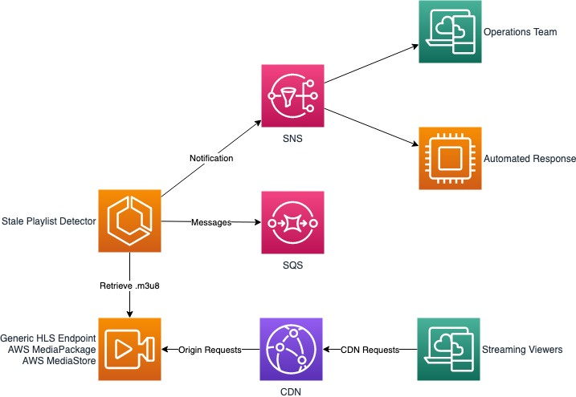

# Stale Playlist Detector (SPD)

## Overview

The Stale Playlist Detector (SPD) is a tool developed in Node.js to monitor live HLS origin endpoints for changing playlists. For live endpoints, a changing playlist means new video segments are being produced and appended to the playlist, and older video segments are being removed from the beginning of the playlist. Other playlist attributes will be updated periodically too. When a live playlist stops changing, it is likely the encoder, network or something else upstream of the packager has stopped working. When the playlists for a live event stops changing, viewers' players using that stream will pause and wait, or stop.

The Stale Playlist Detector (SPD) will use data in the top-level playlist, the child playlists, and other information provided by the operator to determine the time by which each playlist should change. It will regularly sample each playlist at an interval calculated from the playlist's segment time and test for changes by a predetermined deadline. If enough playlists do not change by the deadline, the SPD can issue a notification through SNS or SQS to alert operators or other automated systems there may be a problem with the monitored live stream.

  

  

Read about the [design and operational details](DESIGN.md) of the SPD.

Continue to the [INSTALL](INSTALL.md) guide and try the SPD for yourself.

## Navigate

Navigate to [README](README.md) | [INSTALL](INSTALL.md) | [DESIGN](DESIGN.md)
