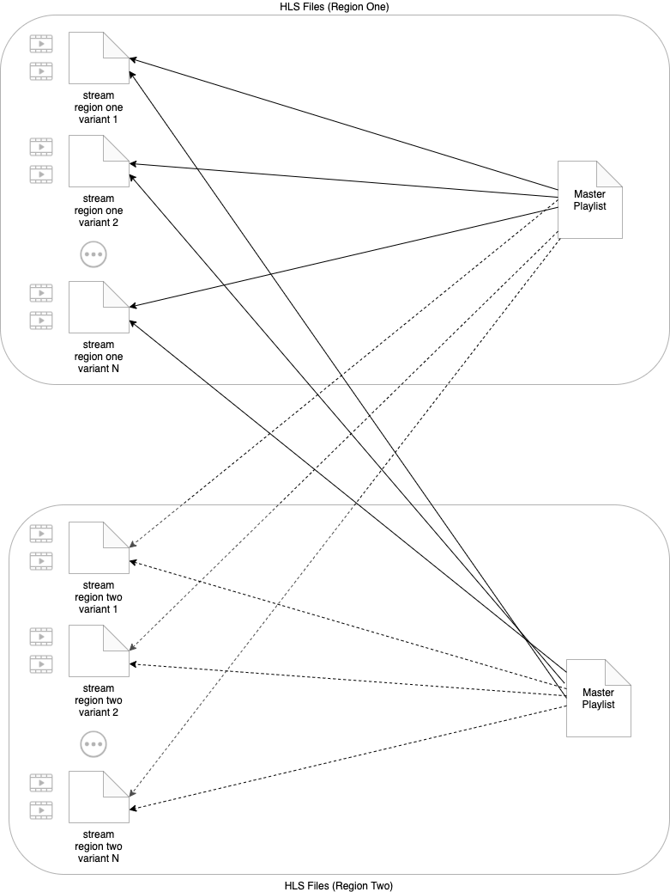

# Clustered Video Streams (CVS)

## Overview

A clustered video stream is an AWS architecture that increases the quality and reliability of live events by providing seamless regional failover capabilities for live video steams. 

Operators can monitor the status of the clustered stream from a single pane of glass and dynamically control which region the stream consumed by a player originates from.  

Failure scenarios addressed:

* **Individual live stream interruption** - Some component in a live stream (encoder, network) goes down and the live stream stops producing new video segments. 
* **AWS region failure** - A regionalized disaster causes an AWS outage in a specific region.  Regional redundancy at all points of the architecture ensure the live stream can recover by failing over to a new region.

## How it works

A ***clustered video stream*** is composed of N identical redundant live video *stream instances* that are each deployed in a different AWS region.   Each ***stream instance*** has an origin HTTP(S) endpoint (MediaPackage, S3, etc.) and an AWS CloudFront CDN HTTP(S) endpoint that are unique to the region.  Stream instances are shown in the purple shaded boxes in [Figure 1 - clustered video…](https://quip-amazon.com/vSwOA2vuRTaU#ATC9CAmI0l9) below.

Figure 1 - clustered video stream architecture

***Origin health checks*** are used to monitor the health of each stream instance.  Health checks continuously test the stream instance for different failure states.  When changes are detected, a message is written to an SNS topic to notify consumers.  Currently, this system has one health check, called the ***stale playlist detector***,  that checks the “liveness“ of a stream instance by monitoring changes to the segments availble in stream playlists.  If the stream stops producing new segments within a time threshold, a failure is detected.

Clustered video stream state is stored in a DynamoDB global ***state table*** so that the state of all the stream instances can be accessed from any region in the cluster.  The state table stores the desired state and health status of each stream instance.  

* **domain** - CloudFront domain for the stream instance.  Used a key to uniquely  identify each stream instance.
* **distro_open** - indicates the desired behavior of a distribution and can be set by an end user. 
* **stale** - indicates whether a stale playlist health check has detected a failure.

A Lambda@Edge function, called the ***copilot,*** is used to change the HTTP(S) responses to requests for  variant playlists and segments from each stream instance.  The copilot lambda is installed on the CloudFront distribution for each stream instance and is triggered by **origin-response** CloudFront events.  The lambda checks the desired state of the stream instance in the state table and will change the HTTP(S) response code to 404 if the distribution is closed (i.e. distro_open is false).  This will trigger error handling in the player to try a different stream variant.

A merged, multi-region, ***master playlist*** is constructed from the top level playlists of each stream instance. This playlist contains the CloudFront endpoints for the stream variants (bitrate ladder playlists) for all of the redundant regions. The master playlist is the origin for the CDN hosted stream that is consumed by the video player.    

The HLS adaptive bitrate protocol enables video players to select from any of the available variants of a stream at any segment boundary.  The player might even select variants from different regions while playing the same video.  

Variant selection is determined by the player based on performance and health of the variant being played.  If a player recieves errors (such as 404s) trying to retrieve segments from a particular variant, it will switch to another variant at the same or different bitrate if one is available.

A ***failover*** occurs when an operator closes a distribution for a stream instance by setting the distro_open attribute to false for that instance.  The copilot lambda will force a 404 return code in responses to all requests for that stream instance.   This forces the player to switch to requesting a stream instance in another region.  As deployed, this system supports ***manual failover*** that must be initiated by an end user by setting the distro_open flag for stream instances.  Automatic failover would be a natural future extension to this capability.

Continue to the [INSTALL](INSTALL.md) guide and try the Clustered Video Streams for yourself.

## Navigate

Navigate to [README](README.md) | [INSTALL](INSTALL.md) | [DESIGN](DESIGN.md)
